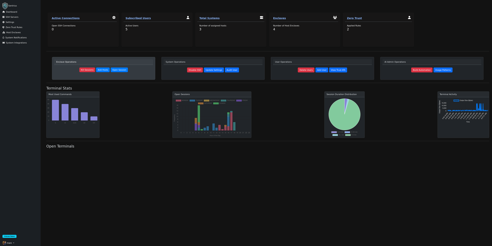

Sentrius

Sentrius is zero trust (and if you want AI assisted) management system. to protect your infrastructure. It is split 
into 
two primary Maven. Currently we only support SSH, but RDP is in the works.
sub-projects:

    core – Handles the core functionalities (e.g., SSH session management, RDP, zero trust policy enforcement).
    api – Provides a RESTful API layer to interface with the core module.
    java-agent -- java based agent to monitor and control the ssh sessions.
    python-agent -- python based agent to monitor and control the ssh sessions.

Internally, Sentrius may still be referenced by its former name, SSO (SecureShellOps), in certain scripts or configurations.
Table of Contents

    Key Features
    Project Structure
    Prerequisites
    Installation
    Configuration
    Running Sentrius
    Usage
    API Documentation
    Deployment to Google Kubernetes Engine (GKE)
    Contributing
    License
    Contact

Key Features

    Zero Trust Security
    Sentrius enforces zero trust policies, ensuring that every SSH connection is authenticated, authorized, and constantly monitored.

    Enclaves
    Group hosts into logical enclaves and apply role-based access control for fine-grained permissions. Simplify security oversight by separating and organizing your infrastructure.

    Dynamic Rules Enforcement
    Define flexible, context-aware rules that adapt to real-time changes in your environment (e.g., user risk score, time of day, IP ranges).

    REST API
    Manage your SSH configurations, enclaves, security rules, and sessions programmatically using a well-documented REST API.

Project Structure

Sentrius consists of multiple sub-projects:

    core
    Contains business logic, including:
        Enclave management
        Zero trust policy enforcement
        Secure SSH connection handling

    api
    A RESTful interface for interacting with the core functionalities. The api module exposes endpoints that let you:
        Create and manage enclaves
        Configure security rules
        Visualize SSH sessions and logs
        Handle user access and authentication

sentrius/
├── core/
│   ├── src/
│   └── pom.xml
├── api/
│   ├── src/
│   └── pom.xml
├── ops-scripts/
│   └── gcp/
│       └── deploy-helm.sh
├── pom.xml
└── ...

Prerequisites

    Java 11 or later
    Apache Maven 3.6+
    Database (PostgreSQL, MySQL, etc.) for storing session and configuration data
    Keycloak for user authentication and authorization
    (Optional) Docker & Kubernetes if you plan to deploy on a containerized environment
    (Optional) python 3.6+ for the python agent

Installation

    Clone the Repository

git clone https://github.com/your-organization/sentrius.git
cd sentrius

Running Sentrius

For convenience the ops/local directory contains a "run-sentrius.sh" script which will start the core and api modules. You can run this script from the project root:

./ops/local/run-sentrius.sh

You are welcome to run the core and api modules separately, as needed. You can start the core module by running:

    mvn install
    cd api
    mvn spring-boot:run

Build the Project

Sentrius uses Maven for its build process. Ensure Maven is installed and then run:

    mvn clean install

    This command will build both the core and api sub-projects, downloading any required dependencies.

Configuration

Sentrius requires properties in order to connect to databases, authenticate users, and configure SSH session parameters. You can supply them in src/main/resources/application.properties or via external configuration (e.g., environment variables or config files).

Typical settings include:

    Database Configuration

spring.datasource.url=jdbc:postgresql://localhost:5432/sentrius
spring.datasource.username=postgres
spring.datasource.password=postgres
spring.jpa.hibernate.ddl-auto=update

Security & Authentication

# JWT or OAuth
To configure Keycloak, you can use the following properties:

    keycloak.realm=sentrius
    keycloak.base-url=${KEYCLOAK_BASE_URL:http://localhost:8180}
    spring.security.oauth2.client.registration.keycloak.client-secret=${KEYCLOAK_SECRET:defaultSecret}
    
    spring.security.oauth2.client.registration.keycloak.client-id=sentrius-api
    spring.security.oauth2.client.registration.keycloak.authorization-grant-type=authorization_code
    spring.security.oauth2.client.registration.keycloak.redirect-uri=${BASE_URL:http://localhost:8080}/login/oauth2/code/keycloak
    spring.security.oauth2.client.registration.keycloak.scope=openid,profile,email
    
    spring.security.oauth2.resourceserver.jwt.issuer-uri=${KEYCLOAK_BASE_URL:http://localhost:8180}/realms/sentrius
    spring.security.oauth2.client.provider.keycloak.issuer-uri=${KEYCLOAK_BASE_URL:http://localhost:8180}/realms/sentrius

SSH Settings

    sentrius.ssh.port=22
    sentrius.ssh.connection-timeout=30000

    Core and API Specifics
        Core might need additional application-specific properties (e.g., caching, logging).
        The API often needs separate configurations for its own port, API versioning, or logging settings.

Feel free to structure your configs based on your environment (dev/test/prod). For large-scale deployments, we recommend using a secure secrets manager (HashiCorp Vault, AWS Secrets Manager, etc.) to avoid storing sensitive information in plain text.

Sentrius can be containerized and deployed to a Kubernetes cluster. You can use the provided Helm script in ops-scripts/gcp/deploy-helm.sh to manage the deployment.

    Build Docker Image (if needed)
    Make sure to build and tag your Docker image, then push it to a container registry accessible by GKE (e.g., Google Container Registry).

    Configure GKE
    Ensure you are logged into your Google Cloud account and have set the correct context for your GKE cluster.

    Run the Helm Deployment Script
    From the project root (or from ops-scripts/gcp), run:

    ./ops-scripts/gcp/deploy-helm.sh <helm-release-name> <gcp-project-id> <any-other-key-or-params>

        <helm-release-name> is the name you want to assign to the Helm release in your cluster.
        <gcp-project-id> is your Google Cloud Platform project ID.
        You may supply additional parameters (keys, environment variables, or overrides) as needed.

This script will:

    Deploy the required Kubernetes resources (Deployments, Services, etc.) for both core and api modules.
    Apply zero trust security rules configuration as specified.
    Expose the api service, typically via a LoadBalancer or an Ingress (depending on your Helm chart configuration).

Contributing

Contributions of all forms are welcome! To get started:

    Fork the repository.
    Create a feature branch for your changes.
    Open a pull request back into the main branch, describing your changes and rationale.

If you encounter any issues or have requests, feel free to open a GitHub Issue. We actively review and address bug reports, feature requests, and general improvements.
License

Sentrius is licensed under the MIT License. For more details, please see the LICENSE file.
Contact

Questions, feedback, or need commercial support? Reach out to the project maintainers:

Email: support@sentrius.io

We’re always happy to help you secure your infrastructure with Sentrius!
