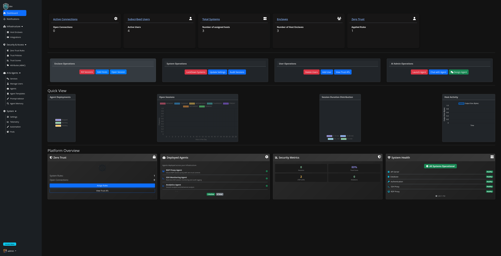

Sentrius



Sentrius is zero trust (and if you want AI assisted) management system. to protect your infrastructure. It is split 
into several maven projects. Agents can be leveraged to monitor and control infra ( SSH, APIs, RDP eventually), ensuring that all connections are secure and compliant with your organization's policies.
Agents can access external resources ( like LLMs or integrations ) via a zero trust assisted access token. 
sub-projects:

    core – Handles the core functionalities (e.g., SSH session management, zero trust policy enforcement).
    api – Provides a RESTful API layer to interface with the core module.
    dataplane – Offers dataplane functionality for secure data transfer and processing.
    integration-proxy – A proxy service that integrates with large language models (LLMs) to enhance security and compliance in SSH sessions.
    llm-dataplane – A data processing layer that leverages LLMs for advanced analysis and decision-making in SSH sessions.
    ops-scripts – Contains operational scripts for deployment and management tasks.
    ai-agent – Java-based intelligent agent framework for monitoring and controlling SSH sessions.
    agent-launcher – Service for dynamically launching and managing agents.
    python-agent – Python-based agent framework for SSH session monitoring and user assistance.

Internally, Sentrius may still be referenced by its former name, SSO (SecureShellOps), in certain scripts or configurations.
Table of Contents

    Key Features
    Project Structure
    Prerequisites
    Installation
    Configuration
    Running Sentrius
    Helm Chart Deployment
    Testing
    Custom Agents
    Usage
    API Documentation
    Contributing
    License
    Contact

Key Features

    Zero Trust Security
    Sentrius enforces zero trust policies, ensuring that every SSH connection is authenticated, authorized, and constantly monitored.

    Enclaves
    Group hosts into logical enclaves and apply role-based access control for fine-grained permissions. Simplify security oversight by separating and organizing your infrastructure.

    Dynamic Rules Enforcement
    Define flexible, context-aware rules that adapt to real-time changes in your environment (e.g., user risk score, time of day, IP ranges).

    REST API
    Manage your SSH configurations, enclaves, security rules, and sessions programmatically using a well-documented REST API.

Project Structure

Sentrius consists of multiple sub-projects:

    core
    Contains business logic, including:
        Enclave management
        Zero trust policy enforcement
        Secure SSH connection handling

    api
    A RESTful interface for interacting with the core functionalities. The api module exposes endpoints that let you:
        Create and manage enclaves
        Configure security rules
        Visualize SSH sessions and logs
        Handle user access and authentication

sentrius/
├── core/
│   ├── src/
│   └── pom.xml
├── api/
│   ├── src/
│   └── pom.xml
├── ops-scripts/
│   └── gcp/
│       └── deploy-helm.sh
├── pom.xml
└── ...

Prerequisites

    Java 17 or later
    Apache Maven 3.6+
    Database (PostgreSQL, MySQL, etc.) for storing session and configuration data
    Keycloak for user authentication and authorization
    (Optional) Docker & Kubernetes if you plan to deploy on a containerized environment
    (Optional) python 3.6+ for the python agent

Installation

    Clone the Repository

git clone https://github.com/your-organization/sentrius.git
cd sentrius

#Running Sentrius

Build the projects from root ( mvn clean install ) to ensure all dependencies are resolved and the modules are compiled.

For convenience the ops/local directory contains a "run-sentrius.sh" script which will start the core and api 
modules. You can run this script from the project root.
This assumes you have a database available, keycloak running, and the necessary configurations. We now require an 
OTEL endpoint, along with neo4j and kafka (but these are optional).:

    ./ops/local/run-sentrius.sh

It is simpler to run a kubernetes deployment, which is described in the Deployment. To do this, build as you would 
above.

Build the images in your local Docker registry (note this builds all images, including core, api, and any other modules):

    /build-images.sh --all --no-cache

Run the Helm deployment script to deploy Sentrius to your local Kubernetes cluster:

    ./ops-scripts/local/deploy-helm.sh


## If Not using TLS
You may wish to forward ports so you can access the services locally. The following commands will forward the necessary ports for the core and api modules:
    kubectl port-forward -n dev service/sentrius-sentrius 8080:8080
    kubectl port-forward -n dev service/sentrius-keycloak 8081:8081

This will require that you either change the hostnames in the deploy-helm script or add entries to your /etc/hosts file to point to localhost for the services.
    127.0.0.1 sentrius-sentrius
    127.0.0.1 sentrius-keycloak

## If Using TLS
The deploy script will automatically install cert-manager and create self-signed certificates for the services. You can access the services via:

    https://sentrius-dev.local
    https://keycloak-dev.local

Add these to /etc/hosts file pointing to your minikube or local cluster IP.
    

There is a GCP deployment that is hasn't been tested in some time. You can find it in the ops-scripts/gcp directory.

You will need to ensure you link to your GKE cluster and have the necessary permissions to deploy resources.

    ./ops-scripts/gcp/deploy-helm.sh <helm-release-name> <gcp-project-id> <any-other-key-or-params>

You are welcome to run the core and api modules separately, as needed. You can start the core module by running:

    mvn install
    cd api
    mvn spring-boot:run

## Testing

### CI/CD Testing

Sentrius includes comprehensive CI/CD testing for Helm charts and Java builds:

- **Automated testing** runs on every push and pull request via GitHub Actions
- **Helm chart validation** including linting, template rendering, and schema validation
- **Integration testing** with Kubernetes clusters for deployment validation

### Local Testing

Test Helm charts locally before deployment:

    # Test all charts
    ./ops-scripts/test-helm-charts.sh
    
    # Test specific aspects
    ./ops-scripts/test-helm-charts.sh lint      # Lint charts
    ./ops-scripts/test-helm-charts.sh template  # Test rendering
    ./ops-scripts/test-helm-charts.sh config    # Test configurations

For detailed testing documentation, see [docs/helm-testing.md](docs/helm-testing.md).

Build the Project

Sentrius uses Maven for its build process. Ensure Maven is installed and then run:

    mvn clean install

    This command will build both the core and api sub-projects, downloading any required dependencies.

Configuration

Sentrius requires properties in order to connect to databases, authenticate users, and configure SSH session parameters. You can supply them in src/main/resources/application.properties or via external configuration (e.g., environment variables or config files).

Typical settings include:

    Database Configuration

spring.datasource.url=jdbc:postgresql://localhost:5432/sentrius
spring.datasource.username=postgres
spring.datasource.password=postgres
spring.jpa.hibernate.ddl-auto=update

Security & Authentication

# JWT or OAuth
To configure Keycloak, you can use the following properties:

    keycloak.realm=sentrius
    keycloak.base-url=${KEYCLOAK_BASE_URL:http://localhost:8180}
    spring.security.oauth2.client.registration.keycloak.client-secret=${KEYCLOAK_SECRET:defaultSecret}
    
    spring.security.oauth2.client.registration.keycloak.client-id=sentrius-api
    spring.security.oauth2.client.registration.keycloak.authorization-grant-type=authorization_code
    spring.security.oauth2.client.registration.keycloak.redirect-uri=${BASE_URL:http://localhost:8080}/login/oauth2/code/keycloak
    spring.security.oauth2.client.registration.keycloak.scope=openid,profile,email
    
    spring.security.oauth2.resourceserver.jwt.issuer-uri=${KEYCLOAK_BASE_URL:http://localhost:8180}/realms/sentrius
    spring.security.oauth2.client.provider.keycloak.issuer-uri=${KEYCLOAK_BASE_URL:http://localhost:8180}/realms/sentrius


SSH Settings

    sentrius.ssh.port=22
    sentrius.ssh.connection-timeout=30000

    Core and API Specifics
        Core might need additional application-specific properties (e.g., caching, logging).
        The API often needs separate configurations for its own port, API versioning, or logging settings.

Feel free to structure your configs based on your environment (dev/test/prod). For large-scale deployments, we recommend using a secure secrets manager (HashiCorp Vault, AWS Secrets Manager, etc.) to avoid storing sensitive information in plain text.

## Helm Chart Deployment

Sentrius provides comprehensive Helm charts for Kubernetes deployment across multiple environments. There are two main charts available:

### Available Charts

1. **sentrius-chart** - Complete Sentrius deployment with all services
2. **sentrius-chart-launcher** - Lightweight chart focused on the launcher service

### Quick Start

#### Local Deployment

```bash
# Build all images
./build-images.sh --all --no-cache

# Deploy to local Kubernetes cluster (HTTP)
./ops-scripts/local/deploy-helm.sh

# OR deploy with TLS enabled for secure transport
./ops-scripts/local/deploy-helm.sh --tls

# OR deploy with TLS and auto-install cert-manager
./ops-scripts/local/deploy-helm.sh --tls --install-cert-manager

# Forward ports for local access (HTTP deployment)
kubectl port-forward -n dev service/sentrius-sentrius 8080:8080
kubectl port-forward -n dev service/sentrius-keycloak 8081:8081
```

**For HTTP deployment**, add to `/etc/hosts`:
```
127.0.0.1 sentrius-sentrius
127.0.0.1 sentrius-keycloak
```

**For TLS deployment**, add to `/etc/hosts`:
```
127.0.0.1 sentrius-dev.local
127.0.0.1 keycloak-dev.local
```

**TLS Requirements:**
- cert-manager must be installed in your cluster. You can:
  - Install manually: `kubectl apply -f https://github.com/cert-manager/cert-manager/releases/download/v1.13.0/cert-manager.yaml`
  - Use auto-install flag: `./ops-scripts/local/deploy-helm.sh --tls --install-cert-manager`
- Access via: `https://sentrius-dev.local` and `https://keycloak-dev.local`
- Self-signed certificates will be automatically generated

#### GCP/GKE Deployment

```bash
# Deploy to GKE cluster
./ops-scripts/gcp/deploy-helm.sh <helm-release-name> <gcp-project-id> <any-other-params>
```

### Chart Configuration

#### Key Configuration Options

**Environment Settings:**
- `environment`: Set to "local", "gke", "aws", or "azure"
- `tenant`: Your tenant identifier
- `subdomain`: Domain for your deployment

**Core Services:**
- `sentrius.image.repository`: Core Sentrius image repository
- `llmproxy.image.repository`: LLM proxy image repository
- `postgres.storageSize`: Database storage allocation

**Ingress Configuration:**
```yaml
ingress:
  enabled: true
  class: "nginx"  # or "gce" for GKE
  tlsEnabled: true
  annotations:
    gke:
      kubernetes.io/ingress.class: gce
      networking.gke.io/managed-certificates: wildcard-cert
```

**TLS/SSL Configuration:**
```yaml
certificates:
  enabled: true  # Enable certificate generation
  issuer: "letsencrypt-prod"  # For AWS/Azure (cert-manager)

# For local development with self-signed certificates:
environment: local
certificates:
  enabled: true
ingress:
  tlsEnabled: true
```

**Agent Configuration:**
```yaml
sentriusagent:
  image:
    repository: sentrius-agent
  oauth2:
    client_id: java-agents
    client_secret: your-secret

sentriusaiagent:
  image:
    repository: sentrius-ai-agent
  oauth2:
    client_id: java-agents
```

#### Custom Values Example

Create a `my-values.yaml` file:
```yaml
environment: "gke"
tenant: "my-company"
subdomain: "my-company.sentrius.cloud"

sentrius:
  image:
    repository: "my-registry/sentrius"
    tag: "v1.0.0"

postgres:
  storageSize: "20Gi"

ingress:
  enabled: true
  tlsEnabled: true
  class: "gce"
```

Deploy with custom values:
```bash
helm install my-sentrius sentrius-chart -f my-values.yaml
```

### Multi-Environment Support

The charts support multiple deployment environments with different configurations:

**Local Development:**
- Uses NodePort services
- Minimal resource requirements
- In-memory storage options

**GKE (Google Cloud):**
- Uses LoadBalancer services
- Managed certificates
- Persistent storage

**AWS:**
- ALB ingress support
- EBS storage classes
- AWS-specific annotations

**Azure:**
- Azure Load Balancer integration
- Azure disk storage
- Azure-specific networking

### Helm Testing

For comprehensive testing documentation including CI/CD testing, local testing, and troubleshooting, see [docs/helm-testing.md](docs/helm-testing.md).

## Custom Agents

Sentrius supports both Java and Python-based custom agents that can extend the platform's functionality for monitoring, automation, and user assistance.

### Java Agents

Java agents are built using the Spring Boot framework and integrate with the Sentrius ecosystem through the agent launcher service.

#### Creating a Custom Java Agent

1. **Create a new Spring Boot module** following the pattern of existing agents:
   ```
   my-custom-agent/
   ├── src/main/java/
   │   └── io/sentrius/agent/mycustom/
   │       ├── MyCustomAgent.java
   │       └── MyCustomAgentConfig.java
   └── pom.xml
   ```

2. **Implement the Agent Interface:**
   ```java
   @Component
   @ConditionalOnProperty(name = "agents.mycustom.enabled", havingValue = "true")
   public class MyCustomAgent implements ApplicationListener<ApplicationReadyEvent> {
       
       @Autowired
       private AgentService agentService;
       
       @Override
       public void onApplicationEvent(ApplicationReadyEvent event) {
           // Register agent and start processing
           agentService.register(this);
       }
   }
   ```

3. **Configuration Properties:**
   ```java
   @ConfigurationProperties(prefix = "agents.mycustom")
   @Data
   public class MyCustomAgentConfig {
       private boolean enabled = false;
       private String name = "my-custom-agent";
       private String description = "Custom agent for specialized tasks";
   }
   ```

4. **Add to application.properties:**
   ```properties
   agents.mycustom.enabled=true
   agents.mycustom.name=my-custom-agent
   agents.mycustom.description=Custom agent for specialized tasks
   ```

5. **Deploy with Helm Chart:**
   ```yaml
   # Add to values.yaml
   mycustomagent:
     image:
       repository: my-custom-agent
       tag: latest
     oauth2:
       client_id: java-agents
       client_secret: your-secret
   ```

#### Java Agent Features

- **Zero Trust Integration**: Automatic ZTAT (Zero Trust Access Token) handling
- **Provenance Tracking**: Built-in event logging and audit trails
- **LLM Integration**: Access to language models through the LLM proxy
- **Session Monitoring**: Real-time SSH session monitoring capabilities
- **RESTful APIs**: Full access to Sentrius APIs and data

### Python Agents

Python agents provide a flexible framework for creating custom automation and user assistance tools.

#### Creating a Custom Python Agent

1. **Set up the agent structure:**
   ```python
   # agents/my_custom/my_custom_agent.py
   from agents.base import BaseAgent

   class MyCustomAgent(BaseAgent):
       def __init__(self, config_manager):
           super().__init__(config_manager, name="my-custom-agent")
           self.agent_definition = config_manager.get_agent_definition('my.custom')
       
       def execute_task(self, task_data=None):
           # Your custom logic here
           self.submit_provenance(
               event_type="CUSTOM_TASK",
               details={"task": "custom_operation", "data": task_data}
           )
           
           return {
               "status": "completed",
               "result": "Custom task executed successfully"
           }
   ```

2. **Create agent configuration:**
   ```yaml
   # my-custom.yaml
   description: "Custom agent that performs specialized tasks"
   context: |
     You are a custom agent designed to handle specific business logic.
     Process requests according to your specialized capabilities.
   ```

3. **Add to application.properties:**
   ```properties
   agent.my.custom.config=my-custom.yaml
   agent.my.custom.enabled=true
   ```

4. **Register in main.py:**
   ```python
   from agents.my_custom.my_custom_agent import MyCustomAgent

   AVAILABLE_AGENTS = {
       'chat-helper': ChatHelperAgent,
       'my-custom': MyCustomAgent,  # Add your agent here
   }
   ```

5. **Run your custom agent:**
   ```bash
   python main.py my-custom --task-data '{"operation": "process_data"}'
   ```

#### Python Agent Features

- **API Integration**: Full access to Sentrius APIs using JWT authentication
- **Configuration Management**: Support for properties files and YAML configurations
- **LLM Proxy Access**: Integration with language models for AI-powered tasks
- **Provenance Submission**: Automatic event tracking and audit logging
- **Keycloak Authentication**: Built-in OAuth2/JWT token management

#### Running Python Agents

```bash
# With properties configuration
python main.py my-custom --config my-app.properties

# With environment variables
export KEYCLOAK_BASE_URL=http://localhost:8180
export KEYCLOAK_CLIENT_ID=python-agents
python main.py my-custom

# Test mode (no external services)
TEST_MODE=true python main.py my-custom
```

### Agent Development Best Practices

1. **Authentication**: Always use proper OAuth2/JWT authentication
2. **Provenance**: Submit detailed provenance events for audit trails
3. **Error Handling**: Implement robust error handling and logging
4. **Configuration**: Use environment-specific configurations
5. **Testing**: Test agents in isolation before integration
6. **Documentation**: Document agent capabilities and configuration options

For detailed Python agent documentation, see [python-agent/README.md](python-agent/README.md).

Contributing

Contributions of all forms are welcome! To get started:

    Fork the repository.
    Create a feature branch for your changes.
    Open a pull request back into the main branch, describing your changes and rationale.

If you encounter any issues or have requests, feel free to open a GitHub Issue. We actively review and address bug reports, feature requests, and general improvements.
License

Sentrius is licensed under the MIT License. For more details, please see the LICENSE file.
Contact

Questions, feedback, or need commercial support? Reach out to the project maintainers:

Email: marc@sentrius.io

We’re always happy to help you secure your infrastructure with Sentrius!
